# Modern Roguelite Systems Documentation

This document provides flowcharts, diagrams, and pseudocode for the core roguelite systems in PrimordialSwamp. It serves as a technical reference for implementing modern roguelite features that match genre leaders like Hades, Dead Cells, and Risk of Rain 2.

---

## Table of Contents

1. [Game Loop Flowchart](#game-loop-flowchart)
2. [Combat System Diagram](#combat-system-diagram)
3. [Meta-Progression System](#meta-progression-system)
4. [Random Seed System](#random-seed-system)
5. [Unlock Tracking System](#unlock-tracking-system)
6. [Challenge Scaling System](#challenge-scaling-system)
7. [Copilot Implementation Guide](#copilot-implementation-guide)

---

## Game Loop Flowchart

The core roguelite loop follows a structured flow from menu to run completion and back.

```mermaid
flowchart TD
    subgraph MainMenu["Main Menu"]
        A[Start Game] --> B{New Run or Continue?}
        B -->|New Run| C[Character Select]
        B -->|Continue| D[Load Saved Run]
        C --> E[Generate Seed]
        E --> F[Initialize Run State]
    end

    subgraph RunLoop["Run Loop"]
        F --> G[Map Scene]
        D --> G
        G --> H{Select Node}
        H --> I{Node Type?}
        
        I -->|Combat| J[Combat Encounter]
        I -->|Resource| K[Resource Event]
        I -->|Event| L[Random Event]
        I -->|Special| M[Special Encounter]
        I -->|Boss| N[Boss Fight]
        I -->|Rest| O[Rest/Heal]
        
        J --> P{Victory?}
        K --> Q[Apply Rewards]
        L --> R[Process Choices]
        M --> S[Handle Special]
        O --> T[Restore Stats]
        
        P -->|Yes| Q
        P -->|No| U[Game Over]
        
        Q --> V[Update Run State]
        R --> V
        S --> V
        T --> V
        
        V --> W{Run Complete?}
        W -->|No| G
        W -->|Yes| X[Victory Screen]
    end

    subgraph MetaProgression["Meta-Progression"]
        U --> Y[Calculate Run Rewards]
        X --> Y
        Y --> Z[Award Fossil Fragments]
        Z --> AA[Check Unlock Conditions]
        AA --> AB[Update Achievements]
        AB --> AC[Save Meta Progress]
        AC --> AD[Return to Menu]
        AD --> A
    end

    subgraph QuickRestart["Quick Restart Flow"]
        U --> AE{Quick Restart?}
        AE -->|Yes| C
        AE -->|No| Y
    end

    style MainMenu fill:#2d5a27
    style RunLoop fill:#4a3b5c
    style MetaProgression fill:#5c3b3b
    style QuickRestart fill:#3b4a5c
```



### Flow Description

1. **Main Menu Phase**: Player selects new run or continues saved run
2. **Character Select**: Choose dinosaur archetype (starter or unlocked)
3. **Run Initialization**: Generate seeded random state, initialize run data
4. **Map Navigation**: Player chooses path through node-based map
5. **Encounter Resolution**: Combat, events, resources processed
6. **Run State Update**: Apply rewards, update health/stamina/traits
7. **Meta-Progression**: On run end, calculate and apply persistent rewards
8. **Quick Restart**: Optional fast path back to character select

---

## Combat System Diagram

The turn-based combat system with targeting, abilities, and status effects.

```mermaid
flowchart TD
    subgraph CombatInit["Combat Initialization"]
        A[Enter Combat] --> B[Load Combatants]
        B --> C[Apply Environmental Modifiers]
        C --> D[Calculate Initiative Order]
        D --> E[Apply Pre-Combat Passives]
    end

    subgraph TurnLoop["Turn Loop"]
        E --> F[Next Combatant Turn]
        F --> G{Is Player?}
        
        G -->|Yes| H[Player Action Phase]
        G -->|No| I[Enemy AI Phase]
        
        H --> J{Select Action}
        J -->|Basic Attack| K[Target Selection]
        J -->|Special Ability| L[Ability Check]
        J -->|Defend| M[Apply Defense Buff]
        J -->|Item| N[Use Item]
        J -->|Flee| O[Flee Check]
        
        L --> P{Has Stamina?}
        P -->|Yes| K
        P -->|No| Q[Show Insufficient Stamina]
        Q --> J
        
        K --> R[Select Body Zone]
        R --> S[Calculate Hit Chance]
        S --> T{Hit?}
        T -->|Yes| U[Calculate Damage]
        T -->|No| V[Miss Animation]
        
        U --> W[Apply Damage Modifiers]
        W --> X[Apply Status Effects]
        X --> Y[Trigger Passives]
        
        I --> Z[AI Decision Tree]
        Z --> AA[Execute AI Action]
        AA --> Y
        
        M --> Y
        N --> Y
        V --> Y
        O --> AB{Escape?}
        AB -->|Yes| AC[Exit Combat - Fled]
        AB -->|No| Y
    end

    subgraph TurnEnd["Turn End Phase"]
        Y --> AD[Process Status Effects]
        AD --> AE[Regenerate Stamina]
        AE --> AF[Check Victory/Defeat]
        
        AF -->|Enemy Defeated| AG{More Enemies?}
        AG -->|Yes| F
        AG -->|No| AH[Victory]
        
        AF -->|Player Defeated| AI[Defeat]
        AF -->|Continue| F
    end

    subgraph Rewards["Combat Rewards"]
        AH --> AJ[Calculate XP]
        AJ --> AK[Award Fossil Fragments]
        AK --> AL[Check Trait Drops]
        AL --> AM[Update Statistics]
        AM --> AN[Return to Map]
    end

    style CombatInit fill:#2d5a27
    style TurnLoop fill:#4a3b5c
    style TurnEnd fill:#5c3b3b
    style Rewards fill:#3b5c4a
```



### Combat Features

- **Body Zone Targeting**: Head, Body, Limbs, Tail, Wings, Weak Spots
- **Damage Types**: Physical, Crushing, Slashing, Piercing, Poison, Sonic
- **Status Effects**: Bleeding, Stunned, Poisoned, Exhausted, Fortified, etc.
- **Environmental Modifiers**: Weather and terrain affect combat
- **Combo System**: Chaining abilities builds Evolution meter

---

## Meta-Progression System

Persistent progression that carries across runs.

```mermaid
flowchart LR
    subgraph Currencies["Meta Currencies"]
        A[Fossil Fragments] --> B[Primary Unlocks]
        C[Research Points] --> D[Codex & Bonuses]
        E[Eggs Collected] --> F[Encyclopedia]
    end

    subgraph UnlockCategories["Unlock Categories"]
        B --> G[Dinosaurs]
        B --> H[Traits]
        B --> I[Encounters]
        B --> J[Starting Bonuses]
        
        D --> K[Scientific Facts]
        D --> L[Permanent Stat Boosts]
        
        F --> M[Dinosaur Profiles]
        F --> N[Achievement Rewards]
    end

    subgraph Conditions["Unlock Conditions"]
        O[Depth Reached] --> G
        P[Wins Count] --> G
        Q[Enemy Defeats] --> H
        R[Discoveries] --> I
        S[Achievements] --> J
    end

    subgraph Statistics["Tracked Statistics"]
        T[Total Runs]
        U[Victories]
        V[Total Deaths]
        W[Enemies Defeated]
        X[Play Time]
        Y[Deepest Depth]
        Z[Fastest Victory]
    end

    style Currencies fill:#5c4a3b
    style UnlockCategories fill:#3b4a5c
    style Conditions fill:#4a5c3b
    style Statistics fill:#5c3b4a
```



### Progression Tiers

| Milestone | Unlocks |
|-----------|---------|
| First Run | Tutorial completion, basic understanding |
| 5 Runs | First dinosaur unlock, trait pool expansion |
| 10 Runs | Build diversity, synergy discovery |
| 25 Runs | Advanced mechanics, achievement hunting |
| 50 Runs | Mastery, daily challenges, completionist goals |

---

## Random Seed System

Seeded random number generation for reproducible runs and daily challenges.

### Pseudocode

```typescript
/**
 * Seeded Random Number Generator using Mulberry32 algorithm
 * Provides deterministic randomness for reproducible runs
 */
class SeededRandom {
  private seed: number;
  private initialSeed: number;

  constructor(seed: string | number) {
    // Convert string seeds to numeric hash
    this.initialSeed = typeof seed === 'string' 
      ? this.hashString(seed) 
      : seed;
    this.seed = this.initialSeed;
  }

  /**
   * Hash a string to a 32-bit integer (djb2 algorithm)
   */
  private hashString(str: string): number {
    let hash = 5381;
    for (let i = 0; i < str.length; i++) {
      hash = ((hash << 5) + hash) + str.charCodeAt(i);
      hash = hash >>> 0; // Convert to unsigned 32-bit
    }
    return hash;
  }

  /**
   * Mulberry32 PRNG - fast, good statistical properties
   * Returns a float between 0 and 1
   */
  next(): number {
    this.seed += 0x6D2B79F5;
    let t = this.seed;
    t = Math.imul(t ^ (t >>> 15), t | 1);
    t ^= t + Math.imul(t ^ (t >>> 7), t | 61);
    return ((t ^ (t >>> 14)) >>> 0) / 4294967296;
  }

  /**
   * Get random integer in range [min, max] inclusive
   */
  nextInt(min: number, max: number): number {
    return Math.floor(this.next() * (max - min + 1)) + min;
  }

  /**
   * Get random float in range [min, max)
   */
  nextFloat(min: number, max: number): number {
    return this.next() * (max - min) + min;
  }

  /**
   * Pick random element from array
   */
  pick<T>(array: T[]): T {
    return array[Math.floor(this.next() * array.length)];
  }

  /**
   * Shuffle array in place using Fisher-Yates
   */
  shuffle<T>(array: T[]): T[] {
    for (let i = array.length - 1; i > 0; i--) {
      const j = Math.floor(this.next() * (i + 1));
      [array[i], array[j]] = [array[j], array[i]];
    }
    return array;
  }

  /**
   * Weighted random selection
   */
  weightedPick<T>(items: T[], weights: number[]): T {
    const totalWeight = weights.reduce((sum, w) => sum + w, 0);
    let random = this.next() * totalWeight;
    
    for (let i = 0; i < items.length; i++) {
      random -= weights[i];
      if (random <= 0) return items[i];
    }
    return items[items.length - 1];
  }

  /**
   * Reset to initial seed state
   */
  reset(): void {
    this.seed = this.initialSeed;
  }

  /**
   * Get current seed for save/restore
   */
  getSeed(): number {
    return this.seed;
  }

  /**
   * Restore seed state (for loading saves)
   */
  setSeed(seed: number): void {
    this.seed = seed;
  }
}

/**
 * Generate daily challenge seed based on date
 */
function generateDailySeed(): string {
  const today = new Date();
  const dateString = `${today.getFullYear()}-${today.getMonth() + 1}-${today.getDate()}`;
  return `DAILY-${dateString}`;
}

/**
 * Generate random run seed
 */
function generateRunSeed(): string {
  return `RUN-${Date.now()}-${Math.random().toString(36).substring(2, 9)}`;
}
```

### Map Generation with Seeded Random

```typescript
/**
 * Generate procedural map using seeded random
 */
function generateMap(seed: string, biome: BiomeType, depth: number): MapNode[][] {
  const rng = new SeededRandom(seed);
  const map: MapNode[][] = [];
  
  // Configuration based on depth
  const config = {
    nodesPerColumn: 2 + Math.min(depth, 3), // 2-5 nodes per column
    columnCount: 10 + depth * 2,             // Map length scales with depth
    combatWeight: 50 - depth * 2,            // Less combat as depth increases
    eliteWeight: depth * 5,                  // More elites at higher depths
    eventWeight: 15 + depth,                 // More events at higher depths
    resourceWeight: 20,                      // Constant resource rate
    specialWeight: 5 + depth,                // More special encounters
  };

  // Generate starting node
  map.push([createNode('0-0', NodeType.REST, 0, biome, rng)]);

  // Generate main map columns
  for (let col = 1; col < config.columnCount - 1; col++) {
    const column: MapNode[] = [];
    const nodeCount = rng.nextInt(2, config.nodesPerColumn);

    for (let row = 0; row < nodeCount; row++) {
      const nodeType = pickNodeType(rng, config, col, config.columnCount);
      const node = createNode(`${col}-${row}`, nodeType, col, biome, rng);
      column.push(node);
    }
    map.push(column);
  }

  // Generate boss node
  map.push([createNode(
    `${config.columnCount - 1}-0`,
    NodeType.BOSS,
    config.columnCount - 1,
    biome,
    rng
  )]);

  // Connect nodes
  connectNodes(map, rng);

  return map;
}

function pickNodeType(
  rng: SeededRandom,
  config: typeof config,
  currentCol: number,
  totalCols: number
): NodeType {
  // Force elite every 5 columns after column 3
  if (currentCol > 3 && currentCol % 5 === 0) {
    return NodeType.ELITE;
  }

  // Rest nodes at 1/3 and 2/3 points
  if (currentCol === Math.floor(totalCols / 3) || 
      currentCol === Math.floor(2 * totalCols / 3)) {
    if (rng.next() < 0.4) return NodeType.REST;
  }

  // Weighted selection for normal nodes
  const types = [
    NodeType.COMBAT,
    NodeType.RESOURCE,
    NodeType.EVENT,
    NodeType.SPECIAL
  ];
  const weights = [
    config.combatWeight,
    config.resourceWeight,
    config.eventWeight,
    config.specialWeight
  ];

  return rng.weightedPick(types, weights);
}
```

---

## Unlock Tracking System

System for tracking and applying unlock conditions.

### Pseudocode

```typescript
/**
 * Unlock condition types and their evaluation
 */
enum UnlockType {
  ALWAYS = 'always',           // Available from start
  DEPTH = 'depth',             // Reach specific map depth
  WINS = 'wins',               // Win N encounters
  DISCOVERIES = 'discoveries', // Discover N facts
  ACHIEVEMENT = 'achievement', // Complete specific achievement
  FOSSIL_COUNT = 'fossil_count', // Collect N fossils total
  BOSS_DEFEAT = 'boss_defeat', // Defeat specific boss
  RUN_COUNT = 'run_count',     // Complete N runs
}

interface UnlockCondition {
  type: UnlockType;
  value?: number | string;
  description: string;
}

interface UnlockableItem {
  id: string;
  category: 'dinosaur' | 'trait' | 'encounter' | 'ability';
  condition: UnlockCondition;
}

/**
 * Unlock Tracker - manages checking and applying unlocks
 */
class UnlockTracker {
  private metaProgress: MetaProgressState;
  private unlockRegistry: Map<string, UnlockableItem>;
  private pendingUnlocks: string[];

  constructor(metaProgress: MetaProgressState) {
    this.metaProgress = metaProgress;
    this.unlockRegistry = new Map();
    this.pendingUnlocks = [];
    this.loadUnlockDefinitions();
  }

  /**
   * Load unlock definitions from data files
   */
  private loadUnlockDefinitions(): void {
    // Load dinosaur unlocks
    dinosaursData.forEach(dino => {
      if (dino.unlockCondition) {
        this.unlockRegistry.set(dino.id, {
          id: dino.id,
          category: 'dinosaur',
          condition: dino.unlockCondition as UnlockCondition,
        });
      }
    });

    // Load trait unlocks
    traitsData.forEach(trait => {
      if (trait.unlockCondition) {
        this.unlockRegistry.set(trait.id, {
          id: trait.id,
          category: 'trait',
          condition: trait.unlockCondition as UnlockCondition,
        });
      }
    });
  }

  /**
   * Check if a specific unlock condition is met
   */
  checkCondition(condition: UnlockCondition): boolean {
    const stats = this.metaProgress.statistics;
    
    switch (condition.type) {
      case UnlockType.ALWAYS:
        return true;

      case UnlockType.DEPTH:
        return stats.deepestDepth >= (condition.value as number);

      case UnlockType.WINS:
        return stats.totalCombats >= (condition.value as number);

      case UnlockType.DISCOVERIES:
        return this.metaProgress.codexEntries.length >= (condition.value as number);

      case UnlockType.ACHIEVEMENT:
        return this.metaProgress.achievements.some(
          a => a.id === condition.value && a.unlocked
        );

      case UnlockType.FOSSIL_COUNT:
        return this.metaProgress.fossilFragments >= (condition.value as number);

      case UnlockType.RUN_COUNT:
        return this.metaProgress.totalRuns >= (condition.value as number);

      case UnlockType.BOSS_DEFEAT:
        return this.metaProgress.statistics.bossesDefeated?.[condition.value as string] > 0;

      default:
        return false;
    }
  }

  /**
   * Check all unlock conditions and return newly unlocked items
   */
  checkAllUnlocks(): UnlockableItem[] {
    const newUnlocks: UnlockableItem[] = [];

    this.unlockRegistry.forEach((item, id) => {
      // Skip if already unlocked
      if (this.isUnlocked(id)) return;

      // Check condition
      if (this.checkCondition(item.condition)) {
        newUnlocks.push(item);
        this.pendingUnlocks.push(id);
      }
    });

    return newUnlocks;
  }

  /**
   * Apply pending unlocks to meta progress
   */
  applyPendingUnlocks(): void {
    this.pendingUnlocks.forEach(id => {
      const item = this.unlockRegistry.get(id);
      if (!item) return;

      switch (item.category) {
        case 'dinosaur':
          if (!this.metaProgress.unlockedDinosaurs.includes(id as DinosaurType)) {
            this.metaProgress.unlockedDinosaurs.push(id as DinosaurType);
          }
          break;

        case 'trait':
          if (!this.metaProgress.unlockedTraits.includes(id)) {
            this.metaProgress.unlockedTraits.push(id);
          }
          break;

        case 'encounter':
          // Add to unlocked encounters list
          break;

        case 'ability':
          // Add to unlocked abilities list
          break;
      }
    });

    this.pendingUnlocks = [];
  }

  /**
   * Check if an item is unlocked
   */
  isUnlocked(id: string): boolean {
    const item = this.unlockRegistry.get(id);
    if (!item) return true; // Unknown items are considered unlocked

    switch (item.category) {
      case 'dinosaur':
        return this.metaProgress.unlockedDinosaurs.includes(id as DinosaurType);
      case 'trait':
        return this.metaProgress.unlockedTraits.includes(id);
      default:
        return false;
    }
  }

  /**
   * Get progress towards an unlock
   */
  getUnlockProgress(id: string): { current: number; target: number; percentage: number } {
    const item = this.unlockRegistry.get(id);
    if (!item) return { current: 0, target: 0, percentage: 100 };

    const condition = item.condition;
    let current = 0;
    const target = (condition.value as number) || 0;

    switch (condition.type) {
      case UnlockType.DEPTH:
        current = this.metaProgress.statistics.deepestDepth;
        break;
      case UnlockType.WINS:
        current = this.metaProgress.statistics.totalCombats;
        break;
      case UnlockType.DISCOVERIES:
        current = this.metaProgress.codexEntries.length;
        break;
      case UnlockType.FOSSIL_COUNT:
        current = this.metaProgress.fossilFragments;
        break;
      case UnlockType.RUN_COUNT:
        current = this.metaProgress.totalRuns;
        break;
    }

    return {
      current,
      target,
      percentage: target > 0 ? Math.min(100, (current / target) * 100) : 100,
    };
  }
}
```

### Achievement System

```typescript
/**
 * Achievement definitions and tracking
 */
interface AchievementDefinition {
  id: string;
  name: string;
  description: string;
  category: 'combat' | 'progression' | 'discovery' | 'special';
  target?: number;
  reward?: {
    type: 'fossils' | 'trait' | 'dinosaur' | 'cosmetic';
    value: string | number;
  };
}

const ACHIEVEMENTS: AchievementDefinition[] = [
  // Combat Achievements
  {
    id: 'first_blood',
    name: 'First Blood',
    description: 'Win your first combat encounter',
    category: 'combat',
    target: 1,
  },
  {
    id: 'extinction_event',
    name: 'Extinction Event',
    description: 'Defeat 100 enemies total',
    category: 'combat',
    target: 100,
    reward: { type: 'fossils', value: 50 },
  },
  {
    id: 'perfect_victory',
    name: 'Perfect Victory',
    description: 'Win combat without taking damage',
    category: 'combat',
  },
  {
    id: 'comeback_kid',
    name: 'Comeback Kid',
    description: 'Win at less than 10% HP',
    category: 'combat',
  },

  // Progression Achievements
  {
    id: 'survivor',
    name: 'Survivor',
    description: 'Complete your first run',
    category: 'progression',
    reward: { type: 'trait', value: 'extinction_survivor' },
  },
  {
    id: 'master_of_evolution',
    name: 'Master of Evolution',
    description: 'Unlock all dinosaurs',
    category: 'progression',
    reward: { type: 'cosmetic', value: 'golden_skin' },
  },

  // Discovery Achievements
  {
    id: 'paleontologist',
    name: 'Paleontologist',
    description: 'Discover all codex entries',
    category: 'discovery',
    reward: { type: 'fossils', value: 100 },
  },
  {
    id: 'fact_finder',
    name: 'Fact Finder',
    description: 'Discover 50 scientific facts',
    category: 'discovery',
    target: 50,
  },

  // Special Achievements
  {
    id: 'darwin_award',
    name: 'Darwin Award',
    description: 'Die to the same species 3 times',
    category: 'special',
  },
  {
    id: 'speedster',
    name: 'Speedster',
    description: 'Complete a run in under 15 minutes',
    category: 'special',
    reward: { type: 'dinosaur', value: 'velociraptor' },
  },
];

/**
 * Achievement Tracker - monitors and awards achievements
 */
class AchievementTracker {
  private achievements: Map<string, Achievement>;
  private listeners: ((achievement: Achievement) => void)[];

  constructor(savedAchievements: Achievement[]) {
    this.achievements = new Map();
    this.listeners = [];
    
    // Initialize from definitions
    ACHIEVEMENTS.forEach(def => {
      const saved = savedAchievements.find(a => a.id === def.id);
      this.achievements.set(def.id, {
        id: def.id,
        name: def.name,
        description: def.description,
        unlocked: saved?.unlocked || false,
        unlockedAt: saved?.unlockedAt,
        progress: saved?.progress || 0,
        maxProgress: def.target,
      });
    });
  }

  /**
   * Update achievement progress
   */
  updateProgress(id: string, progress: number): void {
    const achievement = this.achievements.get(id);
    if (!achievement || achievement.unlocked) return;

    achievement.progress = progress;

    if (achievement.maxProgress && progress >= achievement.maxProgress) {
      this.unlock(id);
    }
  }

  /**
   * Unlock an achievement
   */
  unlock(id: string): void {
    const achievement = this.achievements.get(id);
    if (!achievement || achievement.unlocked) return;

    achievement.unlocked = true;
    achievement.unlockedAt = Date.now();

    // Notify listeners
    this.listeners.forEach(listener => listener(achievement));
  }

  /**
   * Check achievements based on game state
   */
  checkAchievements(state: GameState): void {
    const stats = state.metaProgress.statistics;

    // Combat achievements
    this.updateProgress('extinction_event', stats.totalCombats);

    // Discovery achievements
    this.updateProgress('fact_finder', state.metaProgress.codexEntries.length);

    // Progression achievements
    if (state.metaProgress.victories > 0) {
      this.unlock('survivor');
    }
  }

  /**
   * Subscribe to achievement unlocks
   */
  onUnlock(callback: (achievement: Achievement) => void): void {
    this.listeners.push(callback);
  }

  /**
   * Get all achievements for display
   */
  getAllAchievements(): Achievement[] {
    return Array.from(this.achievements.values());
  }
}
```

---

## Challenge Scaling System

Dynamic difficulty adjustment based on run performance.

```mermaid
flowchart TD
    subgraph Inputs["Scaling Inputs"]
        A[Run Depth] --> E[Calculate Scaling]
        B[Player Performance] --> E
        C[Time Elapsed] --> E
        D[Fossils Collected] --> E
    end

    subgraph Calculation["Scaling Calculation"]
        E --> F{Calculate Difficulty Coefficient}
        F --> G[Base: 1.0 + depth * 0.1]
        G --> H[Performance Modifier]
        H --> I[Time Modifier]
        I --> J[Final Coefficient]
    end

    subgraph Application["Scaling Application"]
        J --> K[Enemy Stats]
        J --> L[Enemy Count]
        J --> M[Reward Multiplier]
        J --> N[Elite Spawn Rate]
    end

    subgraph Outputs["Scaled Outputs"]
        K --> O[+HP, +ATK, +DEF per level]
        L --> P[More enemies in encounters]
        M --> Q[Better drops at higher difficulty]
        N --> R[More challenging encounters]
    end

    style Inputs fill:#3b4a5c
    style Calculation fill:#4a5c3b
    style Application fill:#5c4a3b
    style Outputs fill:#5c3b4a
```



### Pseudocode

```typescript
/**
 * Difficulty scaling system
 */
interface ScalingFactors {
  enemyHealthMult: number;
  enemyAttackMult: number;
  enemyDefenseMult: number;
  enemyCountMod: number;
  rewardMult: number;
  eliteChance: number;
}

class DifficultyScaler {
  private baseCoefficient: number = 1.0;
  private depthMultiplier: number = 0.1;
  private performanceWeight: number = 0.15;

  /**
   * Calculate scaling factors for current run state
   */
  calculateScaling(runState: CurrentRunState): ScalingFactors {
    const depth = runState.depth;
    const performance = this.calculatePerformance(runState);
    const coefficient = this.calculateCoefficient(depth, performance);

    return {
      enemyHealthMult: 1.0 + (coefficient - 1.0) * 0.5,
      enemyAttackMult: 1.0 + (coefficient - 1.0) * 0.3,
      enemyDefenseMult: 1.0 + (coefficient - 1.0) * 0.2,
      enemyCountMod: Math.floor(coefficient / 2),
      rewardMult: 1.0 + (coefficient - 1.0) * 0.4,
      eliteChance: Math.min(0.3, 0.05 + depth * 0.03),
    };
  }

  /**
   * Calculate player performance score (0-1)
   */
  private calculatePerformance(runState: CurrentRunState): number {
    const healthPercent = runState.health / 100; // Assuming 100 max
    const combatEfficiency = runState.combatsWon / Math.max(1, runState.nodesVisited.length);
    const resourceEfficiency = runState.fossilsCollected / (runState.depth + 1) / 10;

    return (healthPercent * 0.4 + combatEfficiency * 0.4 + resourceEfficiency * 0.2);
  }

  /**
   * Calculate difficulty coefficient
   */
  private calculateCoefficient(depth: number, performance: number): number {
    const depthFactor = this.baseCoefficient + depth * this.depthMultiplier;
    const performanceFactor = 1.0 + (performance - 0.5) * this.performanceWeight;
    
    return depthFactor * performanceFactor;
  }

  /**
   * Apply scaling to enemy stats
   */
  scaleEnemy(baseStats: Stats, scaling: ScalingFactors): Stats {
    return {
      ...baseStats,
      health: Math.floor(baseStats.health * scaling.enemyHealthMult),
      maxHealth: Math.floor(baseStats.maxHealth * scaling.enemyHealthMult),
      attack: Math.floor(baseStats.attack * scaling.enemyAttackMult),
      defense: Math.floor(baseStats.defense * scaling.enemyDefenseMult),
    };
  }
}
```

---

## Copilot Implementation Guide

This section provides structured guidance for implementing these systems.

### Game Design Doc Sections Required

1. **Core Loop Specification**
   - Run structure and phases
   - Node encounter flow
   - Victory/defeat conditions

2. **Combat System Specification**
   - Turn order calculation
   - Damage formula
   - Status effect interactions
   - AI behavior patterns

3. **Progression System Specification**
   - Currency earn rates
   - Unlock cost balancing
   - Achievement thresholds

4. **Randomization Specification**
   - Seed format and generation
   - Map generation parameters
   - Encounter weight tables

### Implementation Priority

| Priority | System | Complexity | Dependencies |
|----------|--------|------------|--------------|
| P1 | Seeded Random | Low | None |
| P1 | Unlock Tracker | Medium | Meta Progress Types |
| P2 | Map Generation | High | Seeded Random |
| P2 | Achievement System | Medium | Unlock Tracker |
| P3 | Difficulty Scaling | Medium | Run State |
| P3 | Daily Challenges | Low | Seeded Random, Map Gen |

### File Structure

```
src/
├── systems/
│   ├── SeededRandom.ts        # Random number generation
│   ├── UnlockTracker.ts       # Unlock condition checking
│   ├── AchievementTracker.ts  # Achievement monitoring
│   ├── DifficultyScaler.ts    # Dynamic difficulty
│   └── MapGenerator.ts        # Procedural map creation
├── data/
│   ├── achievements.json      # Achievement definitions
│   └── unlocks.json           # Unlock conditions
└── types/
    └── Meta.types.ts          # Meta-progression types
```

### Testing Considerations

- Seed reproducibility tests (same seed = same sequence)
- Unlock condition edge cases
- Achievement trigger verification
- Scaling formula validation
- Map connectivity guarantees

---

*This documentation supports the Modern Roguelite Feature Set Alignment issue. See also: [Game Design Document](../GAME_DESIGN.md), [Evolution Roadmap](../EVOLUTION_ROADMAP.md), [Feature Checklist](roadmap/01-modern-roguelite-features.md)*
